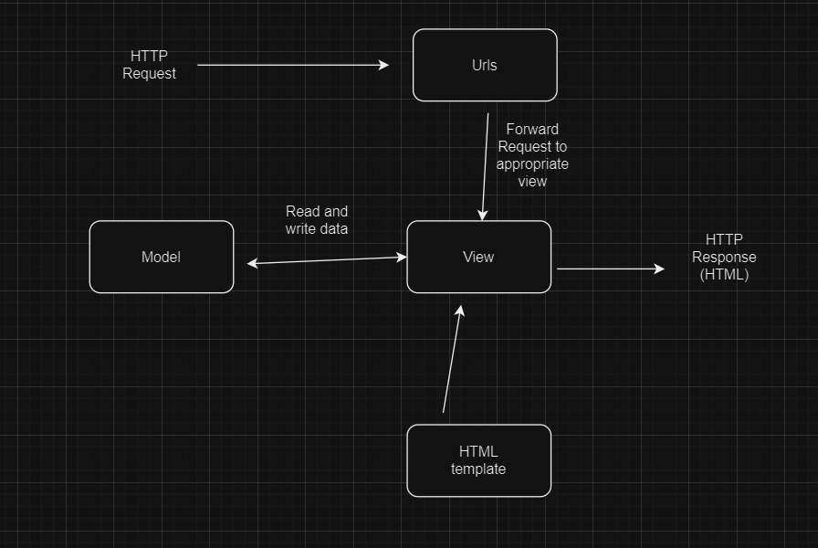
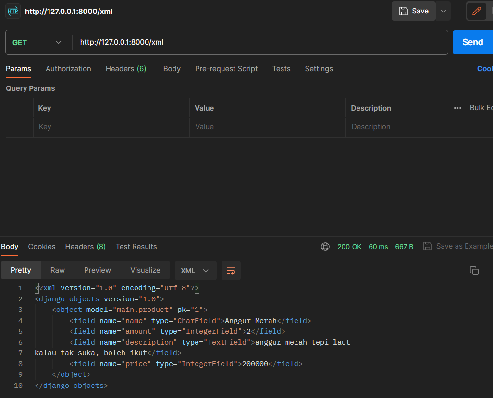
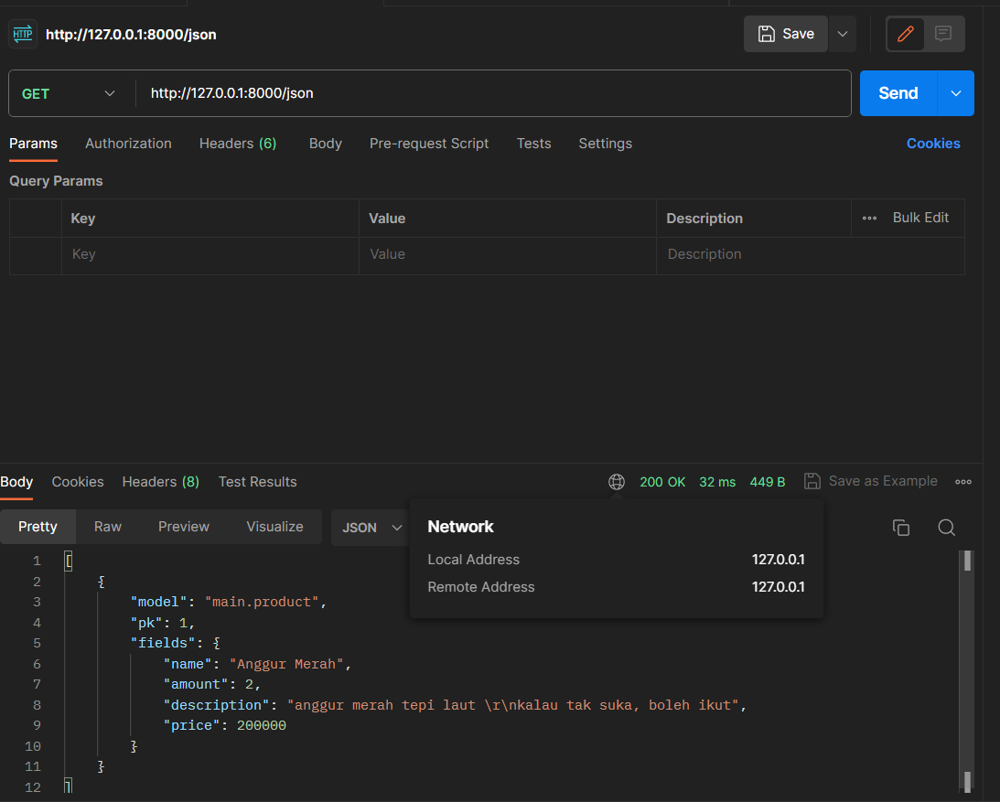
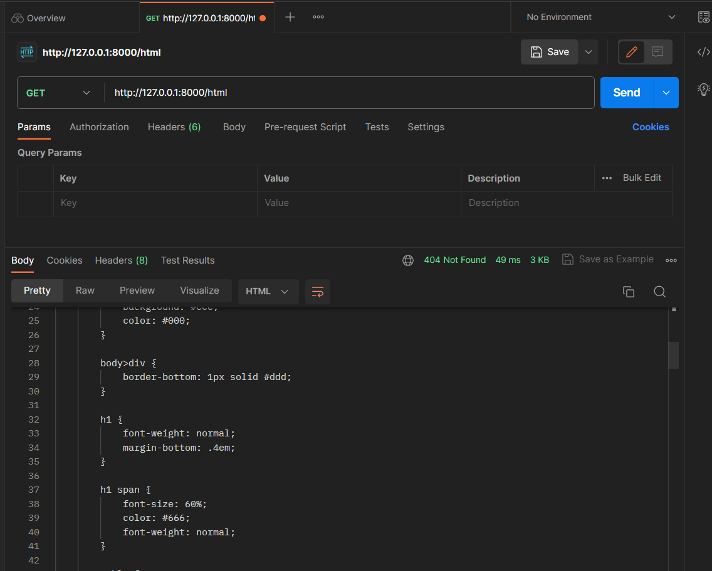
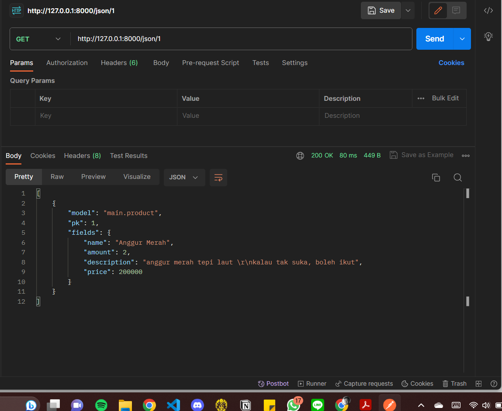
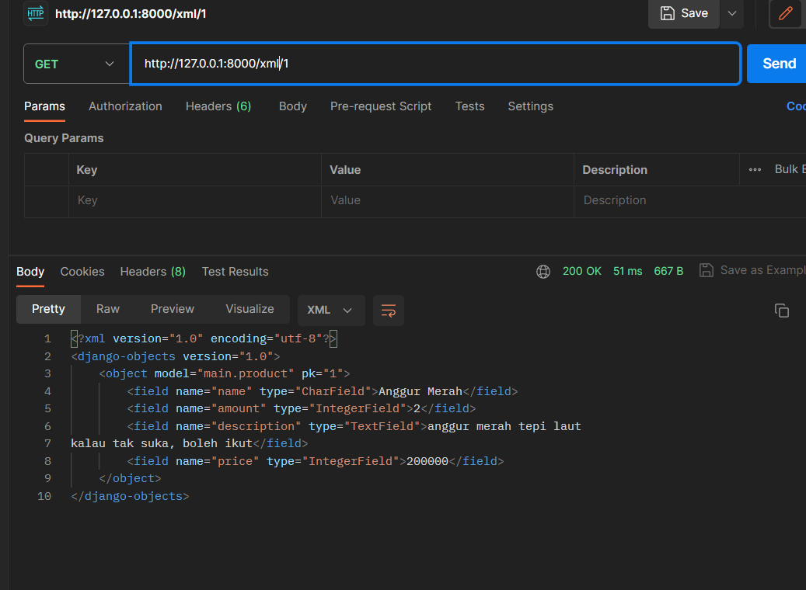

[ASSIGNMENT 2]
URL : (im still struggling deploying my app through the adaptable.io)

Question 1: How do you Implement the tasks in the checklist
A. Create a django project 
1. activate the virtual environment
2. pip install the requirements 
3. create the django project using the django-admin startproject [project name]
4. add '*' to the allowed host in the settings.py

B. Create an app with the name main on that project 
1. run the python manage.py startapp main
2. open the settings.py file in the project directory and add main to the INSTALLED_APPS list

C. Create a URL routing configuration to access the main app
1. create the urls.py in the main app directory 
2. code the urls.py in the main app directory
3. open the urls.py in the project directory and import the include library
4. add the url pattern that directs to the main inside the urlpattern list 

D. Create a model on the main app with name Item and these mandatory attributes
1. modifying the models.py file in the main application directory, taking account of the mandatory attributes
2. run the python manage.py makemigrations
3. run the python manage.py migrate 

C. Create a function in views.py that returns an HTML template containing your application name, your name, and your class.
1. create the template directory
2. create an html that contains placeholder for the name, class, npm, and app name 
3. inside the views.py file in the main app directory, import render and add the show main function according to the templates inside the HTML file 

E. Create a routing in urls.py to map the function in views.py to an URL
1. open the url.py inside the project directory and add path to the main view within the url patterns. 
2. runserver in order to make sure the HTML file works as intended 

F. Deploy your app to Adaptable so it can be accessed through the internet
1. push all the project to github
2. push the new app button inside the adaptable.io
3. connect adaptable.io to github
4. choose the project repository
5. choose the python app template and postgre sql
6. adjust the python version
7. In the Start Command section, enter the command python manage.py migrate && gunicorn shopping_list.wsgi
8. enter the application name
9. check the http listener port and click the deploy app button

Question 2: Create a diagram explaining the flow of client requests to a django web and its response

Question 3: What is the purpose of a virtual environment? Can we create a Django web app without a virtual environment?
A virtual environment is a self-contained directory that contains a specific Python interpreter and a set of libraries and packages. Its purpose is to manage and isolate python dependency for many different python project. Technically we can create a django project without virtual environment. However, it can leads into multiple problems such as: dependency conflicts, version control issues, and security risks. 

Question 4: What is MVC, MVT, and MVVM? Explain the differences between the three

MVC (Model-View-Controller), MVT (Model-View-Template), and MVVM (Model-View-ViewModel) are design patterns or architectural patterns used in software development, particularly in the context of developing user interfaces (UI) for applications.  While MVC, MVT, and MVVM are all architectural patterns used for structuring software applications, they differ in how they handle the separation of concerns between the Model, View, and the component responsible for handling user interactions and presentation logic. Each pattern has its strengths and is suitable for different types of applications and development contexts.

[ASSIGNMENT 3]
1.  What is the difference between POST form and GET form in Django?
The difference of POST and GET in Django mainly is on the purpose. POST is primarily used for submitting data to the server. When you submit a form using POST, the form data is included in the request body. This is suitable for sensitive or large amounts of data, such as when creating a new record in a database. Whereas, GET is primarily used for retrieving data from the server. When you submit a form using GET, the form data is appended to the URL as query parameters. This method is suitable for search queries and filtering data but should not be used for sensitive or large data.

2. What are the main differences between XML, JSON, and HTML in the context of data delivery?
One of the difference of XML, JSON, and HTML is in the format or the structure/format of the language. XML uses a hierchichal data that acts as a tree and represent the tags such like and object entities. JSON is a lightweight, human-readable format that uses key-value pairs to represent data.  HTML is a markup language that uses tags to structure content for web browsers. In other words, XML is a versatile markup language for structured data, JSON is a lightweight and efficient format for data interchange, and HTML is primarily used for defining the structure and presentation of web content.

3.  Why is JSON often used in data exchange between modern web applications?
JSON's combination of simplicity, efficiency, cross-platform compatibility, and community support makes it an excellent choice for data exchange in modern web applications. Its role is especially prominent in the development of web APIs, single-page applications, and microservices architecture.

4.  Explain how you implemented the checklist above step-by-step (not just following the tutorial).
    1. Activate the virtual environment 
    2. Create the base.html file in the root directory 
    3. Adjust the main.html file from the previous assignment 
    4. In the main directory create a form.py file that accepts new item data 
    5. In the views.py at main folder, create a "create_product" function that automatically add new product when the form is submitted 
    6. Modify the "show_main" function in views.py
    7. add the new url path to access the previously made and imported function 
    8. add the new HTML template in the main directory called the create_product.html 
    9. Show the added data from the form by creating table inside the main.html file
    10. Create show_xml function and add its path to the urlpattern
    11. Create the show_json function and add its path to the urlpattern 
    12. Create the show_json_by_id and show_xml_by_id function and add their path to the urlpattern 
    13. Check the request and response via Postman 

5.  Access the five URLs in point 2 using Postman, take screenshots of the results in Postman, and add them to README.md.
    1. XML 
        

    2. JSON
        

    3. HTML 
        

    4. JSON by id 
        

    5. XML by id 
        

[ASSIGNMENT 4 ]
1.  What is UserCreationForm in Django? Explain its advantages and disadvantages.
"UserCreationForm" is a built in form class provided by the Django authentication framework that simplifies the process of creating a new user account. Advantages: ease of use, integration with authentication, highly customizable, built in validation, and includes various security features. Whereas the disadvantages are limited flexibilities, frontend customization, and assumes default user model. 

2. What is the difference between authentication and authorization in Django application? Why are both important?
Authentication is about verifying the user's identity while authorization is about granting or denying access to the user. Furthermore, authentication typically involves the use of credentials, biometric, or other identity verfication methods; Authorization relies on permissions and access control lists (ACLs) to determine what actions a user is allowed to perform. Both are important for security purposes since together, they provide a security framework that ensures that only authorized and authenticated users can access certain parts of the application or perform specific actions.

3. What are cookies in website? How does Django use cookies to manage user session data?

Cookies are small pieces of data that a web server sends to a user's web browser and are stored locally on the user's machine. They commonly used to store informations about the user's interactions. When a user logs in to a website, a session cookie is created and stored on their device. This cookie contains a unique identifier that the server uses to associate subsequent requests from the same user with their session data on the server. This enables the server to maintain user-specific information, such as authentication status, shopping cart contents, or user preferences, throughout the user's visit to the site.

4. Are cookies secure to use? Is there potential risk to be aware of?
Although cookies are fundamental component of web development and are generally safe to use, like any other technology cookies comes with potential security risks. Few of them are: (1) storing sensitive information such as passwords or personally identifiable informations, directly in cookies is a significant security risks. (2) If session identifiers are not adequately protected, attackers may attempt to hijack a user's session by stealing their session cookie. (3) Excessive tracking and use of cookies for profiling user behavior can raise privacy concerns.

5.  Explain how you implemented the checklist above step-by-step (not just following the tutorial).
    1. Create register function in views.py 
    2. Create HTML file of the register function
    3. Add new path url of the register function to the urlpatterns 
    4. Create login function 
    5. Create login.html
    6. Add new path url of the login function to the urlpatterns
    7. Create logout function
    8. modify the main.html template 
    9. add path of the logout to the urls.py  
    10. add the login required to the show main function 
    11. modify the login user function so that it would required the user to sign in. 
    12. add the last login entity to the models 
    13. modify the logout user so that it would record the cookies 
    14. modify the main.html to show the recorded last login session 
    15. connect the product model to the user model 
    
[ASSIGNMENT 5]
1. Explain the purpose of some CSS element selector and when to use it.
a. Type Selector
Purpose: target all instance of a HTML tag on webpage. 
When to use: apply the occurance of the style to a particular HTML tag

b. Class Selector

Purpose: Class selectors target HTML elements with a specific class attribute value.
When to Use: Use class selectors when you want to apply a style to one or more elements that share a common class. This allows for more targeted styling without affecting all elements of the same type.

c. ID Selector

Purpose: ID selectors target a single HTML element with a unique id attribute value.
When to Use: Use ID selectors when you want to style a specific element uniquely. IDs should be unique within a page, so this selector is best suited for one-time styling instances.

d. Descendant Selector

Purpose: Descendant selectors target elements that are descendants of a specified element.
When to Use: Use descendant selectors when you want to style elements that are nested within another element. It allows you to apply styles to specific elements within a hierarchy.

e. Pseudo-Element Selector

Purpose: Pseudo-element selectors target specific parts of an element, such as the first line or first letter.
When to Use: Use pseudo-element selectors when you want to apply styles to a specific part of an element's content. For example, you can style the first letter of a paragraph differently.

2. Explain some of the HTML5 tags that you know.

a. <header>

Purpose: Represents a container for introductory content or a set of navigational links. Typically used for page headers, logos, and main navigation menus.

b. <nav>

Purpose: The <nav> tag is used to define a section of navigation links. It's commonly placed within the <header> or <footer> elements.

c. <footer>

Purpose: The <footer> tag defines the footer of a section or a document. It typically contains copyright information, contact details, and links to related resources.

3. What are the differences between margin and padding?

Margins control the space outside of an element, creating space between the element and its neighboring elements. Whereas, padding controls the space inside of an element, creating space between the element's content and its border.

4. What are the differences between the CSS framework Tailwind and Bootstrap? When should we use Bootstrap rather than Tailwind, and vice versa?

The main difference between Tailwind and Boostrap is Tailwind CSS is known for its utility-first approach, where you create styles by applying utility classes directly to HTML elements. It offers a wide range of pre-defined classes for styling, layout, and responsiveness. Whereas, Bootstrap follows a component-based approach, providing a set of pre-designed components (e.g., buttons, modals, navbars) that you can use out of the box. The use of Tailwind is common when maximum customization control, a minimal CSS footprint, and prefer utility-first styling is very much needed. On the other hand, Bootstrap is used if you need a set of pre-designed UI components, want a polished and opinionated design, or require JavaScript components out of the box.

5. Explain how you implemented the checklist above step-by-step (not just following the tutorial).

a. Modify the HTML files with respect to the Bootstrap Documentation
b. For the form input HTML: create_product.html, register.html, edit_product.html, and login.html breaks down the form input instead of using the {{ form.as_table }}

The result of the modification:
A. base.html


<!DOCTYPE html>
<html lang="en">
    <head>
        
            <meta charset="UTF-8" />
            <meta name="viewport" content="width=device-width, initial-scale=1">
        
        <link href="https://cdn.jsdelivr.net/npm/bootstrap@5.3.2/dist/css/bootstrap.min.css" rel="stylesheet" integrity="sha384-T3c6CoIi6uLrA9TneNEoa7RxnatzjcDSCmG1MXxSR1GAsXEV/Dwwykc2MPK8M2HN" crossorigin="anonymous">
        
        
        
    </head>

    <body>
        
        
    </body>
</html>

B. create_product.html 
 





    

      InventLaris
    

    

      <h5 class="card-title text-center">Add New Product</h5>
      

    <form method="POST" action="" class="card-body" value="add_product">
        
        

            <label for="id_name" class="form-label">Name</label>
            <input type ="text" name="name" class="form-control" id="id_name" placeholder="Enter Product Name">
        

        

            <label for="id_price" class="form-label">Price</label>
            <input type="number" class="form-control" name="price" id="id_price" placeholder="Enter Product Price">
        

        

            <label for="id_description" class="form-label">Description</label>
            <textarea class="form-control" name="description" id="id_description" rows="3" ></textarea>
        

        

            <label for="id_amount" class="form-label">Amount</label>
            <input type="number" class="form-control" name="amount" id="id_amount" placeholder="Enter Product Amount" >
        

        

            <button class="btn btn-outline-primary" type="submit">Add New Product</button>
        

    </form>
    

  
 


C. edit_product.html 






    

        InventLaris
    

    

        <h5 class="card-title text-center">Edit Product</h5>

        <form method="post" action="/edit-product/{{ids}}" class="card-body">
            
            

                <label for="id_name" class="form-label">Name</label>
                <input type="text" name="name" class="form-control" id="id_name" value="{{ form.instance.name }}">
            

            

                <label for="id_price" class="form-label">Price</label>
                <input type="number" class="form-control" name="price" id="id_price" value="{{ form.instance.price }}">
            

            

                <label for="id_description" class="form-label">Description</label>
                <textarea class="form-control" name="description" id="id_description"
                    rows="3">{{ form.instance.description }}</textarea>
            

            

                <label for="id_amount" class="form-label">Amount</label>
                <input type="number" class="form-control" name="amount" id="id_amount"
                    placeholder="Enter Product Amount" value="{{ form.instance.amount }}">
            

            

                <button class="btn btn-outline-primary" type="submit" value="edit product">Edit Product</button>
            

        </form>

    



D. main.html




<!DOCTYPE html>
<html lang="en">

<head>
  <meta charset="UTF-8">
  <title>{{ app_name }}</title>

  <!-- Navbar -->
  <nav class="navbar bg-light fixed-top">
    

      <a class="navbar-brand" href="#">
        <svg xmlns="http://www.w3.org/2000/svg" width="16" height="16" fill="currentColor"
          class="bi bi-bar-chart-line-fill" viewBox="0 0 16 16">
          <path
            d="M11 2a1 1 0 0 1 1-1h2a1 1 0 0 1 1 1v12h.5a.5.5 0 0 1 0 1H.5a.5.5 0 0 1 0-1H1v-3a1 1 0 0 1 1-1h2a1 1 0 0 1 1 1v3h1V7a1 1 0 0 1 1-1h2a1 1 0 0 1 1 1v7h1V2z" />
        </svg>
        InventLaris
      </a>

      <ul class="nav justify-content-end">
        <li class="nav-item">
          
Last login: {{ last_login }}

        </li>
        <li class="nav-item">

          <a class="nav-link active" href="">
            

              <button class="btn btn-outline-primary" type="submit">Logout</button>
            

          </a>
        </li>

      </ul>
    

</head>

<body>

  

    

      InventLaris Table
    

    

      <table class="table">

        <thead>
          <tr>
            <th scope="col">Name</th>
            <th scope="col">Price</th>
            <th scope="col">Amount</th>
            <th scope="col">Description</th>
            <th scope="col">Date Added</th>
            <th scope="col">Manipulate Data</th>
          </tr>
        </thead>

        
        <tbody>
          <tr>
            <td>{{ product.name }}</td>
            <td>{{ product.price }}</td>
            <td>{{ product.amount }}</td>
            <td>{{ product.description }}</td>
            <td>{{ product.date_added }}</td>
            <td>
              

                <a href="" class="btn btn-primary">Edit</a>
                <a href="" class="btn btn-primary">Delete</a>
              

            </td>
          </tr>
        </tbody>
        
      </table>

      <a href="">
        

          <button class="btn btn-primary" type="button">Add New Product</button>
        

      </a>

    

  

</body>
 
</html>


E. login.html



    

      InventLaris
    

    

      <h5 class="card-title">Login</h5>
      
Don't have an account? <a href="">Register Now</a>

      <form method="POST" action="" class="card-body">
        
        <table>
            <tr>
                <td>Username: </td>
                <td><input type="text" name="username" placeholder="Username" class="form-control"></td>
            </tr>
                    
            <tr>
                <td>Password: </td>
                <td><input type="password" name="password" placeholder="Password" class="form-control"></td>
            </tr>

            
            <tr>
                
                    
{{ message }}

                
            </tr>
               
        </table>
         
        <button type="submit" class="btn btn-outline-primary" value='login'>Login</button>
    </form>
    

  
   



F. register.html



    <title>Register</title>


  

    

      InventLaris
    

    

      <h5 class="card-title">Register</h5>

      <form method="POST" action="" class="card-body row g-3" value="">
            
            

                <label for="username" class="form-label">Username</label>
                <input type="text" name="username" required class="form-control"  placeholder="Enter Username">
            

            

                <label for="password" class="form-label">Password</label>
                <input type="password" name="password1" required class="form-control"  placeholder="Enter Password">
            

            

                <label for="password" class="form-label">Confirm Password</label>
                <input type="password" name="password2" required class="form-control"  placeholder="Re-Enter Password">
            

            
             
            <button type="submit" class="btn btn-outline-primary" value='Register'>Sign Up </button>

              
            <ul>   
                  
                    <li>{{ message }}</li>  
                      
            </ul>   
            

            
            <ul>
                <li class="alert alert-danger" role="alert">{{ form.errors.username }}</li>
            </ul>
            
            
            <ul>
                <li class="alert alert-danger" role="alert">{{ form.errors.password1 }}</li>
            </ul>
            
            
            <ul>
                <li class="alert alert-danger" role="alert">{{ form.errors.password2 }}</li>
            </ul>
        
        </form>
   

 



